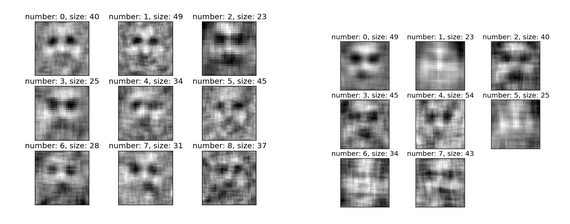

# short report

## Face Recognition in pure noise images

In the outlook of our BCI report we wrote about ideas for different bases or primitives. I thought the one with pure noise images to be the most promising one and decided to do some short experiments with it. All code can be found in a git repository [https://github.com/dedan/noisetest]. discussion and outlook in the end of this file.

The idea is from [Gosselin 2003] where the focus was on showing that superstitious perceptions (seeing a face in a cloud or a pure noise image) could reveal properties of the internal representations of the perceived objects. This is not the topic of this work, but their experiment shows effects which could be used in our EEG painting paradigm. They presented pure noise images to subjects and told them that a subset of the images are actually faces, overlayed with strong white noise. They asked the subjects to select those images which contain faces and when this selection was summed up, actual face like shapes became visible. In a follow-up experiment of this work, pure noise images could be presented to the subject after a training phase of actual objects with noise overlay. Then again ERPs could be used to select the target noise images that could on average approximate faces. We think that noise, with correlations introduced by convolution with a rectangular or gaussian kernel, would be more likely to trigger superstitious perceptions. This effect could serve as the previously mentioned hierarchy in the primitives.

What I did here was replacing the human by a face detection algorithm. I presented random noise images which were smoothed by a rectangular kernel to the algorithm and summed up the areas in which the algorithm detected faces. I furthermore investigated the influence of different classifiers and the smoothing kernel width.

I presented 100 x 100 pixel images which looked similar to the following:

and asked the algorithm to look for faces. Here some examples of false positives (the ones which are interesting for us)

The structure of the rest of the experiment is the following. The script face_detect.py creates 10.000 times a random image and presents it to the algorithm. If a face was detected the region in question is saved to a results structure. This method is repeated for different settings.

    kernel_width = 3, 5, 10 pixels
    different classifier training files
    xml_files = ['haarcascade_frontalface_default.xml'],
                 'haarcascade_eye.xml',
                 'haarcascade_frontalface_alt.xml']

The results are saved to different folders and analysed using the average_faces.py script. A first summary of the results can be found in the following tabular data:

`table`

the table clearly shows that only the frontalface default classifier might be interesting for us because the other classifiers don’t give us the false positives that we need. Maybe they are too good. I also just realized that the eye classifier is really only for single eyes and the average of the 57 detected images for the kernel width of 10 just gives the outline of an eye.

So, interesting is the influence of the kernel size on the detected images. The following plot shows a histogram of the patch (face) size detected by the algorithm. It clearly shows that the size of the detected face is proportional to the kernel size.

left: kernel width = 5 pixel, right: kernel width = 10 pixel

I now faced the problem that the patches are all of different size, therefore I first summed up all patches of equal size. Again left image is the small kernel.

the images are numbered by the rank of how many patches I had available for them. So the images with a smaller number look smoother because they are the average of more images. The images for a kernel width of five show more details. I think that a kernel of 10 is already too large for a 100 x 100 image.

I then averaged all patches by doing a kind of interpolation (not sure whether it is the right word for what I did) The smallest patch size was chosen as the final size (23 pixels) and pixels from larger images were mapped to their corresponding pixel in the smaller patch, without any fancy averaging because I just wanted a quick solution. Here the results, again for kernel = 5 and 10.

I think the black line comes from some rounding I do when computing the corresponding pixel in the small patch, but I didn’t have the time to really look into it.

So, kernel size of 5 looks nicer for a 100 x 100 image size and the default classifier gave us the most false positives, here the whole thing again for 100.000 iterations.

I have to think about a better interpolation procedure because this average looks less face like than the averages over patches of the same size.

Summary: When the average over patches in which a face detection algorithm saw faces leads to face like images, why shouldn’t it work to use an Event Related Potential in an Oddball paradigm to select noise stimuli and reconstruct imaginary images. One further short experiment to confirm the potential of our idea would be to repeat my experiment of today with another classifier trained on e.g. houses. If this also works I am very optimistic that we can reconstruct images from noise.

Problems: to get a more or less clear picture of a face we need thousands of iterations and we cannot ask our subjects to sit there for such a long time. Maybe the selection process can be speeded up by first showing images produced with a wider kernel to select the outlines of the object and then add finer kernel width noise to fill in the details.
Another problem that the algorithm selects patches containing the images, resulting in location and size. The ERP of a human in an oddball experiment would only give us the global information of an image. This will also slow down the recognition. Maybe can also be overcome by a gradually building image -> first wider kernel -> selected images get overlayed in background -> small kernel noise will be added on top to fill in the details.

further tests:

* use wider so small kernel width also with the face detection algorithm to try to find more faces in less iterations
* use another classifier (e.g. houses)
* better interpolation

